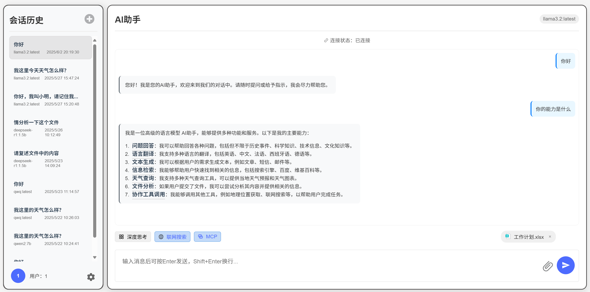
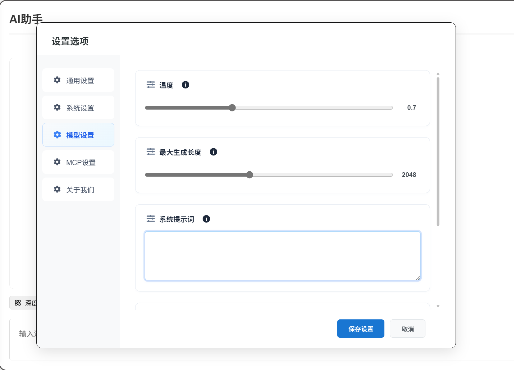
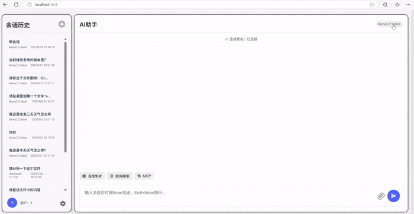
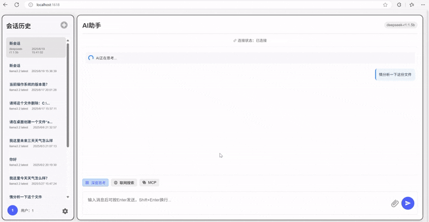
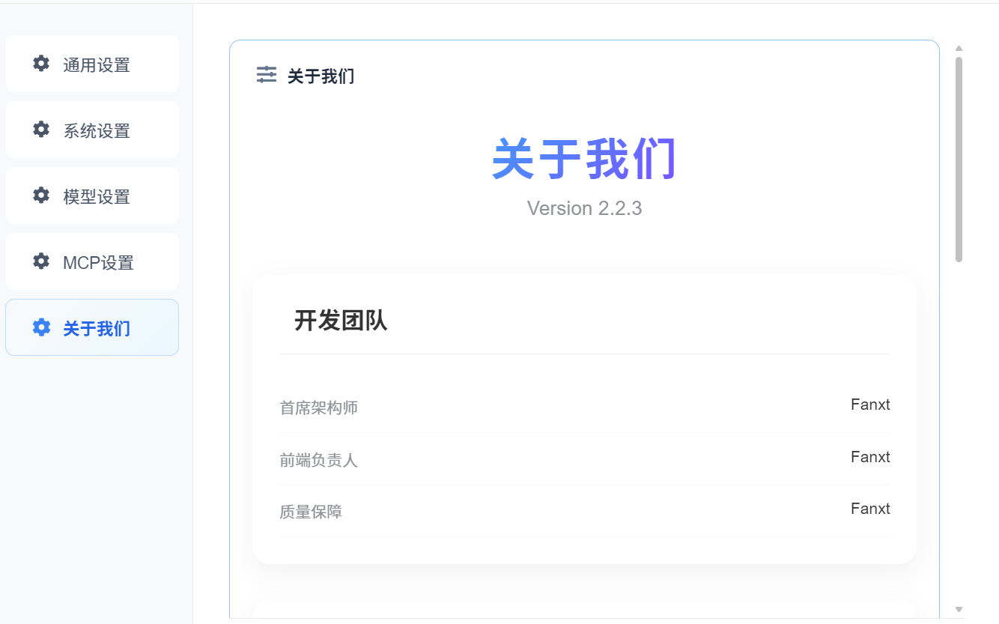

# ✨Local_Helper

🎉欢迎下载项目！！！🎉

 

#### 介绍
🎉支持本地大模型的可视化应用
我们在将大模型部署到本地后，是否会因为命令行界面而感到不方便呢？💻本项目作为一个轻量级本地大模型调用框架搭建的可视化本地对话应用，
🚀从此大家只需要拉取模型，或者将训练后的模型导入到ollama，直接使用该应用即可实现本地模型的调用，从此告别排队！
🍰项目已经开源至gitee、github👇 

https://github.com/fanxt0218/Local_Helper
 
如果您觉得该开源项目对您有帮助，请给该项目点个star，谢谢！🌟
更详细的发开介绍 -->👉 https://blog.csdn.net/2402_84949062?spm=1011.2266.3001.5343  <--请访问我的主页

#### 更新日志
请关注更新日志: <a src="https://gitee.com/fan_xt/local_helper/blob/local_helper-v2.0.0/update_log.txt">Local_Helper更新日志

#### 软件架构◪
Java语言基于Springboot框架进行开发，软件集成Spring AI框架，持久层框架mybatis- plus
#### 界面效果

#### 安装教程〄

1.  将项目克隆到本地
2.  启动ollama服务，ollama serve(默认启动)
3.  点击启动即可

#### 使用说明☼🎁

1.  确保本机已安装ollama服务且ollama已经存在模型
2.  配置文件中更改数据库连接信息，连接数据库
3.  执行doc目录下的local_helper_init.sql执行脚本
4.  项目自带的MCP Server已经默认配置了天气服务、IP服务，如果需要使用，建议先在配置文件中配置对应密钥
5. ---> 先启动mcp-server模块、再启动local_helper_client模块 <----
6. 项目启动后浏览器访问1618端口
7. 右上角下拉框选择本地的不同大模型进行使用
8. 在输入框输入信息点击发送即可使用
9. 在发送信息前，你同样可以选择是否启用某些功能，比如MCP，他决定是否使用为当前模型配置工具（不过要注意不支持工具的模型无法使用该功能）
10. 目前我们还支持上传一些附件交给大模型进行分析，支持常见的文件格式
11. 在左下角的设置中，可以为项目设置一些参数，比如字体大小、主题模式，以及一些控制模型输出相关的参数（比如温度、提示词、采样度等），同样的，你还可以手动引入外部的MCP服务加入到项目中
    
12. 在左侧的侧边栏中，记录了你的不同对话记录
  一些特性:
    应用支持在同一个会话中频繁切换模型，虽然侧边栏中记录的是创建时的模型名称，但是在聊天过程中切换模型新的模型会继承旧模型的记忆

#### 快速演示 ⚡

### 注意 📍

如果要使用mcp服务请先在mcp-server模块中配置相关配置
通过转发端口使用ollama服务速度可能较慢，尤其是参数较大的模型
在启用mcp发送请求时，控制台可能会出现Bad Request错误，这是因为您使用的模型比较冷门并且不支持tools，关于这点您可以联系我们或者自行修改项目对应位置
调用mcp工具时，请尽量选择参数稍大的模型，避免不佳的使用体验
如果在使用过程中修改了服务地址，那么请先重启服务
模型参数设置等能够在客户端进行修改的设置项，请尽量不要直接在配置文件中进行修改，以免造成数据不一致的情况
由于项目仍在初期阶段，许多功能仍未完善
项目会不断改进和维护，希望大家多多支持♥

#### 🤝参与贡献✉

1.  该项目由gitee快乐哦呜所属
2.  如若在使用过程中遇到bug，请在gitee或github提出您的建议
3.  想要参与对项目的开发和完善，请联系我，或以PR的方式贡献代码 
4.  作者学生党,望大家多多支持
5.  开发者CSDN账号：Fanxt_Ja

